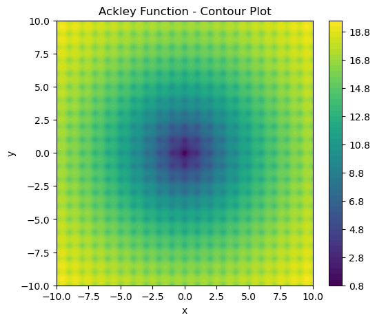
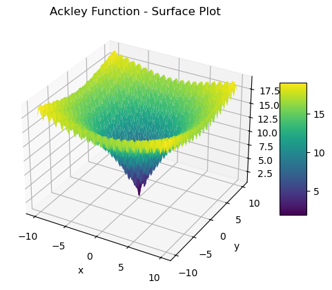
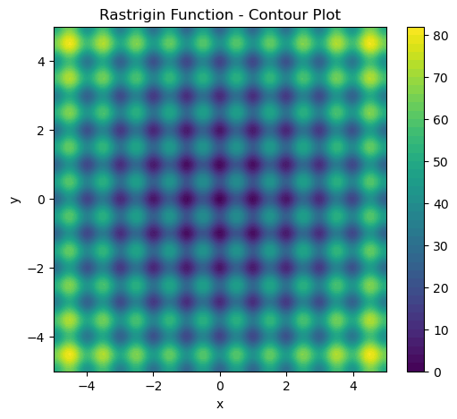
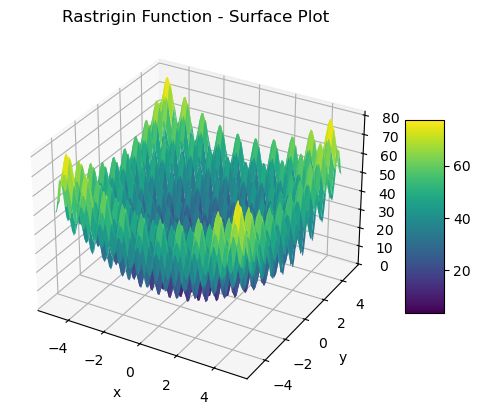
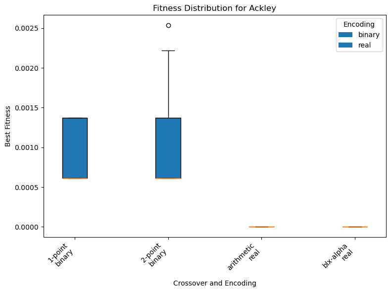
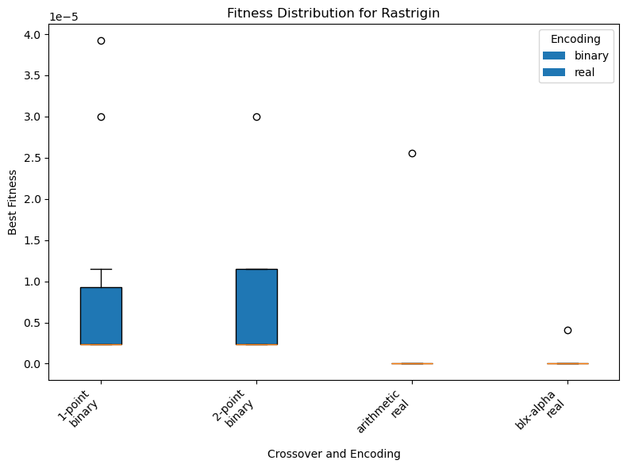

# Benchmark Optimization Functions Using Genetic Algorithms

**Student Assignment Report**  
**Submitted by: Terebenț Roxana**  
**Date: June 4, 2025**  
 
Babeș-Bolyai University, Cluj-Napoca, Romania

---

## Table of Contents
- [Introduction](#introduction)
- [Selected Functions](#selected-functions)
  - [Ackley Function](#ackley-function)
  - [Rastrigin Function](#rastrigin-function)
- [Function Visualization](#function-visualization)
- [Genetic Algorithm Configurations](#genetic-algorithm-configurations)
- [Experimental Results](#experimental-results)
  - [Summary Statistics](#summary-statistics)
  - [Box Plots](#box-plots)
  - [Statistical Analysis](#statistical-analysis)
- [Conclusions](#conclusions)
- [Code Structure and Documentation](#code-structure-and-documentation)
- [Acknowledgments](#acknowledgments)
- [References](#references)

---

## Introduction
This report presents the implementation and analysis of a Genetic Algorithm (GA) to optimize two multimodal benchmark functions: the Ackley and Rastrigin functions. The project involves implementing these functions in Python, visualizing them using 2D contour and 3D surface plots, optimizing them with a configurable GA, and performing statistical analysis to compare different GA configurations. The GA supports binary and real-valued encodings, with two crossover methods per encoding, and adjustable parameters such as population size, number of generations, mutation rate, and crossover rate. The results are analyzed using summary statistics and t-tests to evaluate performance differences across configurations.

---

## Selected Functions
Two multimodal functions were selected from the Virtual Library of Simulation Experiments [1]. Both are 2-dimensional and known for their challenging landscapes with multiple local minima.

### Ackley Function
The Ackley function is defined as:

$$ f_1(x, y) = -20 \exp\left(-0.2 \sqrt{0.5 (x^2 + y^2)}\right) - \exp\left(0.5 (\cos(2\pi x) + \cos(2\pi y))\right) + 20 + e $$

- **Domain**: $[-10, 10] \times [-10, 10]$
- **Global Minimum**: $f_1(0, 0) = 0$

The function has a complex landscape with a deep global minimum at the origin, surrounded by multiple local minima, making it suitable for testing optimization algorithms.

### Rastrigin Function
The Rastrigin function is defined as:

$$ f_2(x, y) = 20 + (x^2 - 10 \cos(2\pi x)) + (y^2 - 10 \cos(2\pi y)) $$

- **Domain**: $[-5, 5] \times [-5, 5]$
- **Global Minimum**: $f_2(0, 0) = 0$

The Rastrigin function features a highly multimodal landscape with many local minima, posing a significant challenge for optimization algorithms.

---

## Function Visualization
Both functions were visualized using 2D contour and 3D surface plots to illustrate their landscapes.

<table style="width:100%; table-layout: fixed;">
  <tr>
    <td></td>
    <td></td>
  </tr>
  <tr>
    <td style="text-align: center;">(a) Contour Plot</td>
    <td style="text-align: center;">(b) Surface Plot</td>
  </tr>
</table>

*Figure 1: Visualization of the Ackley function.*

<table style="width:100%; table-layout: fixed;">
  <tr>
    <td></td>
    <td></td>
  </tr>
  <tr>
    <td style="text-align: center;">(a) Contour Plot</td>
    <td style="text-align: center;">(b) Surface Plot</td>
  </tr>
</table>

*Figure 2: Visualization of the Rastrigin function*

The contour plots (Figures 1a and 2a) show the functions' complex landscapes, with the Ackley function having a smoother basin around the global minimum and the Rastrigin function exhibiting a grid-like pattern of local minima. The surface plots (Figures 1b and 2b) provide a 3D perspective, highlighting the depth and distribution of minima.

---

## Genetic Algorithm Configurations
The GA was implemented with the following features:

- **Encodings**:
  - Binary: Individuals are represented as 32-bit strings (16 bits per variable).
  - Real-valued: Individuals are represented as pairs of floating-point numbers.
- **Crossover Methods**:
  - Binary: 1-point and 2-point crossover.
  - Real-valued: Arithmetic and BLX-$\alpha$ crossover (with $\alpha = 0.5$).
- **Parameters**:
  - Population size: 500
  - Number of generations: 100
  - Mutation rate: 0.05
  - Crossover rate: 0.8
- **Selection**: Tournament selection with a tournament size of 3.
- **Fitness Function**: Negative of the objective function (to convert minimization to maximization).

Each configuration was run 30 times with different random seeds to ensure robust statistical analysis. The number of fitness evaluations was fixed at 50,000 (500 population × 100 generations) per run.

---

## Experimental Results
Experiments were conducted for all combinations of encodings and crossover methods for both functions. The results are summarized below.

### Summary Statistics
The following table presents the mean and standard deviation of the best fitness values across 30 runs for each configuration.

| Function  | Encoding | Crossover   | Mean Fitness (×10⁻⁴) |
|-----------|----------|-------------|----------------------|
| Ackley    | binary   | 1-point     | 8.3942               |
| Ackley    | binary   | 2-point     | 9.8245               |
| Ackley    | real     | arithmetic  | 0.0000               |
| Ackley    | real     | blx-alpha   | 0.0000               |
| Rastrigin | binary   | 1-point     | 0.0631               |
| Rastrigin | binary   | 2-point     | 0.0693               |
| Rastrigin | real     | arithmetic  | 0.0085               |
| Rastrigin | real     | blx-alpha   | 0.0014               |

*Table 1: Summary statistics of best fitness values across 30 runs.*

For the Ackley function, real-valued encodings achieved near-zero fitness ($4.4409 \times 10^{-16}$), indicating convergence to the global minimum. Binary encodings performed worse, with means around $8.3942 \times 10^{-4}$ and $9.8245 \times 10^{-4}$. For the Rastrigin function, real-valued encodings again outperformed binary encodings, with BLX-$\alpha$ achieving the lowest mean fitness ($1.3757 \times 10^{-7}$).

### Box Plots
Box plots illustrate the distribution of best fitness values for each configuration.

  
*Figure 3: Box plot of fitness distributions for the Ackley function.*

  
*Figure 4: Box plot of fitness distributions for the Rastrigin function.*

The box plots confirm that real-valued encodings (orange) consistently achieve lower fitness values than binary encodings (blue) for both functions, with tighter distributions indicating more consistent performance.

### Statistical Analysis
T-tests were performed to compare:
- Binary crossover methods (1-point vs. 2-point).
- Real-valued crossover methods (arithmetic vs. BLX-$\alpha$).
- Aggregated binary vs. real-valued encodings.

#### Ackley Function
- **1-point vs. 2-point (Binary)**: $t = -1.2407$, $p = 0.2204$, not significant. Means: $8.3942 \times 10^{-4}$ (1-point) vs. $9.8245 \times 10^{-4}$ (2-point).
- **Arithmetic vs. BLX-$\alpha$ (Real)**: Equal variances; means identical ($4.4409 \times 10^{-16}$), no difference.
- **Binary vs. Real**: $t = 15.7328$, $p < 0.0001$, significant. Means: $9.1093 \times 10^{-4}$ (binary) vs. $4.4409 \times 10^{-16}$ (real).

#### Rastrigin Function
- **1-point vs. 2-point (Binary)**: $t = -0.3154$, $p = 0.7537$, not significant. Means: $6.3131 \times 10^{-6}$ (1-point) vs. $6.9290 \times 10^{-6}$ (2-point).
- **Arithmetic vs. BLX-$\alpha$ (Real)**: $t = 0.8276$, $p = 0.4143$, not significant. Means: $8.5126 \times 10^{-7}$ (arithmetic) vs. $1.3757 \times 10^{-7}$ (BLX-$\alpha$).
- **Binary vs. Real**: $t = 5.7798$, $p < 0.0001$, significant. Means: $6.6210 \times 10^{-6}$ (binary) vs. $4.9442 \times 10^{-7}$ (real).

The t-tests indicate no significant differences between crossover methods within the same encoding for either function. However, real-valued encodings significantly outperform binary encodings for both functions ($p < 0.0001$).

---

## Conclusions
The GA successfully optimized the Ackley and Rastrigin functions, with real-valued encodings (arithmetic and BLX-$\alpha$ crossovers) consistently outperforming binary encodings (1-point and 2-point crossovers). For the Ackley function, real-valued encodings converged to the global minimum (fitness $\approx 0$), while binary encodings achieved fitness values around $8 \times 10^{-4}$ to $9 \times 10^{-4}$. For the Rastrigin function, real-valued encodings, particularly BLX-$\alpha$, achieved lower fitness values ($1.3757 \times 10^{-7}$) compared to binary encodings ($6 \times 10^{-6}$ to $7 \times 10^{-6}$). Statistical tests confirmed that real-valued encodings significantly outperform binary encodings, but no significant differences were found between crossover methods within the same encoding.

The results suggest that real-valued encodings are better suited for these multimodal functions due to their ability to represent solutions with higher precision and explore the search space more effectively. Future work could explore adaptive mutation rates or hybrid encodings to further improve performance.

---

## Code Structure and Documentation
The Python codebase is modular, with separate files for:

- `functions_plots.py`: Function definitions and visualization.
- `ga.py`: GA implementation with encoding and crossover options.
- `analysis.py`: Statistical analysis and plotting.
- `gui.py`: Tkinter-based GUI for interactive experimentation.
- `main.py`: Main script to run experiments and launch the GUI.

All code is documented with docstrings and comments, and the GUI allows users to configure parameters, run experiments, and visualize results.

---

## Acknowledgments
The implementation uses the `numpy`, `matplotlib`, `pandas`, `scipy`, and `tkinter` libraries. Function definitions were adapted from [1].

---

## References
1. Surjanovic, S. and Bingham, D. (2013). Virtual Library of Simulation Experiments: Test Functions and Datasets. Available at: http://www.sfu.ca/~ssurjano. Accessed: May 13, 2025.